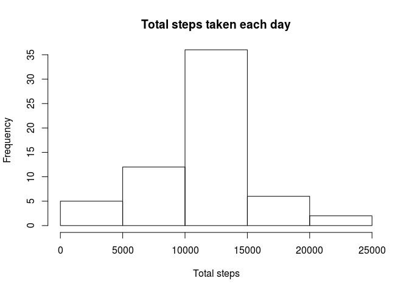

## Introduction

It is now possible to collect a large amount of data about personal movement using activity monitoring devices such as a [Fitbit][1], [Nike Fuelband][2], or [Jawbone Up][3]. These type of devices are part of the “quantified self” movement – a group of enthusiasts who take measurements about themselves regularly to improve their health, to find patterns in their behavior, or because they are tech geeks. But these data remain under-utilized both because the raw data are hard to obtain and there is a lack of statistical methods and software for processing and interpreting the data.

This assignment makes use of data from a personal activity monitoring device. This device collects data at 5 minute intervals through out the day. The data consists of two months of data from an anonymous individual collected during the months of October and November, 2012 and include the number of steps taken in 5 minute intervals each day.

The data for this assignment can be downloaded from the course web site:

Dataset: [Activity monitoring data][4] [52K]

[1]:https://www.fitbit.com/fr/home
[2]:https://www.fitbit.com/fr/home
[3]:https://www.jawbone.com
[4]:https://d396qusza40orc.cloudfront.net/repdata%2Fdata%2Factivity.zip


The variables included in this dataset are:

- **steps**: Number of steps taking in a 5-minute interval (missing values are coded as <span style="color:red">NA</span>)  
- **date**: The date on which the measurement was taken in YYYY-MM-DD format  
- **interval**: Identifier for the 5-minute interval in which measurement was taken  
The dataset is stored in a comma-separated-value (CSV) file and there are a total of 17,568 observations in this dataset.

Loading and preprocessing the data

```r
activity <- read.csv("activity.csv")
activity$date<-as.Date(activity$date, format ="%Y-%m-%d")
str(activity)
```

```
## 'data.frame':	17568 obs. of  3 variables:
##  $ steps   : int  NA NA NA NA NA NA NA NA NA NA ...
##  $ date    : Date, format: "2012-10-01" "2012-10-01" ...
##  $ interval: int  0 5 10 15 20 25 30 35 40 45 ...
```
## What is mean total number of steps taken per day?

Calculate the total number of steps taken per day

```r
library(dplyr)
```

```
## 
## Attaching package: 'dplyr'
```

```
## The following objects are masked from 'package:stats':
## 
##     filter, lag
```

```
## The following objects are masked from 'package:base':
## 
##     intersect, setdiff, setequal, union
```

```r
totalSteps_day<- summarise(group_by(activity, date), total_steps = sum(steps))
str(totalSteps_day)
```

```
## Classes 'tbl_df', 'tbl' and 'data.frame':	61 obs. of  2 variables:
##  $ date       : Date, format: "2012-10-01" "2012-10-02" ...
##  $ total_steps: int  NA 126 11352 12116 13294 15420 11015 NA 12811 9900 ...
```
Make a histogram of the total number of steps taken each day

```r
hist(totalSteps_day$total_steps,
     main="Total steps taken each day",
     xlab = "Total steps",
     ylim = c(0,35))
```

<!-- -->

```r
dev.copy(png, file="totalStepsPerDay.png", width=480, height=480)
```

```
## png 
##   3
```

```r
dev.off()
```

```
## png 
##   2
```
Mean and median of the total number of steps taken per day

```r
meanSteps_day<-mean(totalSteps_day$total_steps, na.rm = TRUE)
print(meanSteps_day)
```

```
## [1] 10766.19
```

```r
medianSteps_day<-median(totalSteps_day$total_steps, na.rm = TRUE)
print(medianSteps_day)
```

```
## [1] 10765
```
The mean and median of the total number of steps taken per day is 1.0766189\times 10^{4} and 10765, respectively.

## What is the average daily activity pattern?

Time series plot of the 5-minute interval the average numberof steps taken, averaged across all days

```r
aveSteps_interval<-summarise(group_by(activity, interval), aveSteps = mean(steps, na.rm = TRUE))
plot(aveSteps_interval$interval, aveSteps_interval$aveSteps,
     type = "l",
     main="Daily averaged number of steps taken",
     xlab="5-minute interval",
     ylab="Steps number")
```

<!-- -->

```r
dev.copy(png, file="dailyAveragedNumberOfSteps.png", width=480, height=480)
```

```
## png 
##   3
```

```r
dev.off()
```

```
## png 
##   2
```

5-minute interval containing the maximum average number of step averaged across all days

```r
maxInterval<-which.max(aveSteps_interval$aveSteps)
print(maxInterval)
```

```
## [1] 104
```
The 5-minute interval containing the maximum average number of step averaged across all days is 104 


## Imputing missing values

Total number of missing values

```r
numMissingVal<-sum(is.na(activity$steps))
print(numMissingVal)
```

```
## [1] 2304
```
There are `numMissingVal` <color:red">NA</span>s in the datasets.

In order to eliminate all <span style="color:red">NA</span>s in the dataset without disturb the statistic property too much, the <span style="color:red">NA</span>s in the dataset are replaced by average number of steps in the corresponding interval.


```r
activity_filled<- activity
interval<-activity_filled$interval[is.na(activity$steps)]
activity_filled$steps[is.na(activity$steps)]<-round(aveSteps_interval$aveSteps[match(interval,aveSteps_interval$interval)])
str(activity_filled)
```

```
## 'data.frame':	17568 obs. of  3 variables:
##  $ steps   : num  2 0 0 0 0 2 1 1 0 1 ...
##  $ date    : Date, format: "2012-10-01" "2012-10-01" ...
##  $ interval: int  0 5 10 15 20 25 30 35 40 45 ...
```
After imputing, calculate the total number of steps taken per day

```r
filledTotalSteps_day<- summarise(group_by(activity_filled, date), total_steps = sum(steps))
str(filledTotalSteps_day)
```

```
## Classes 'tbl_df', 'tbl' and 'data.frame':	61 obs. of  2 variables:
##  $ date       : Date, format: "2012-10-01" "2012-10-02" ...
##  $ total_steps: num  10762 126 11352 12116 13294 ...
```
Make a histogram of the total number of steps taken each day

```r
hist(filledTotalSteps_day$total_steps,
     main="Total steps taken each day",
     xlab = "Total steps",
     ylim = c(0,35))
```

<!-- -->

```r
dev.copy(png, file="FilledTotalStepsPerDay.png", width=480, height=480)
```

```
## png 
##   3
```

```r
dev.off()
```

```
## png 
##   2
```
Mean and median of the total number of steps taken per day

```r
filledMeanSteps_day<-mean(filledTotalSteps_day$total_steps)
print(filledMeanSteps_day)
```

```
## [1] 10765.64
```

```r
filledMedianSteps_day<-median(filledTotalSteps_day$total_steps)
print(filledMedianSteps_day)
```

```
## [1] 10762
```
After imputing the <span style="color:red">NA</span>s, the mean and median of the total number of steps taken per day is 1.0765639\times 10^{4} and 1.0762\times 10^{4}, respectively. As the <span style="color:red">NA</span>s are replaced by average values, the mean of the total number of steps per day is unchanged, while the median is no longer that before imputing the <span style="color:red">NA</span>s.

## Are there differences in activity patterns between weekdays and weekends?
Create a new factor variable in the dataset with two levels – `weekday` and `weekend` indicating whether a given date is a weekday or weekend day.

```r
day<-weekdays(activity_filled$date)
day[weekdays(activity_filled$date)%in%c("Saturday", "Sunday")]<-"weekend"
day[!(weekdays(activity_filled$date)%in%c("Saturday", "Sunday"))]<-"weekday"
day<-factor(day, levels = c("weekend", "weekday"))
activity_filled<-cbind(activity_filled,day)
str(activity_filled)
```

```
## 'data.frame':	17568 obs. of  4 variables:
##  $ steps   : num  2 0 0 0 0 2 1 1 0 1 ...
##  $ date    : Date, format: "2012-10-01" "2012-10-01" ...
##  $ interval: int  0 5 10 15 20 25 30 35 40 45 ...
##  $ day     : Factor w/ 2 levels "weekend","weekday": 2 2 2 2 2 2 2 2 2 2 ...
```
Time series plot of the 5-minute interval the average number of steps taken, averaged across all weekday days or weekend days

```r
aveSteps_interval_Day<-summarise(group_by(activity_filled, interval,day), aveSteps = mean(steps, na.rm = TRUE))
library(lattice)
xyplot(aveSteps ~ interval| day, data =aveSteps_interval_Day,
       layout = c(1,2), type="l",
       xlab="interval",ylab="Number of steps")
```

<!-- -->

```r
dev.copy(png, file="dailyAveragedNumberOfSteps_weekdays.png", width=480, height=480)
```

```
## png 
##   3
```

```r
dev.off()
```

```
## png 
##   2
```
The figure depicts that:  
during weekdays, the activity happens around from the 500nd interval, which is earlier than that during weekend. The peak value of number of steps during weekday is higher than that during weekend. Moreover, then distibution of number of steps between the inteval 700 and 2100 during weekend is relatively more homogeneous than that during weekday.
